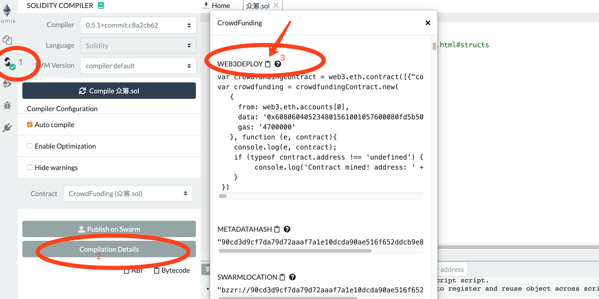
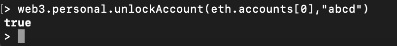
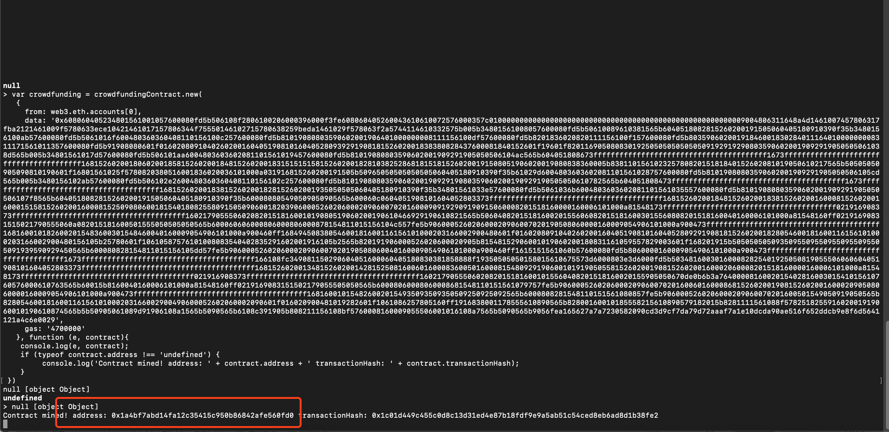
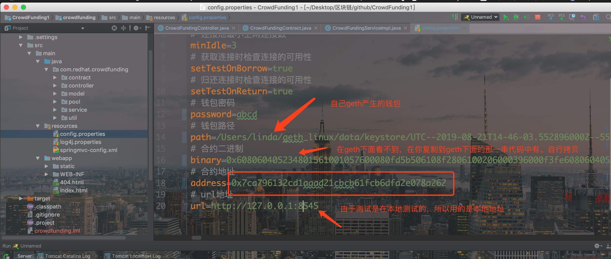
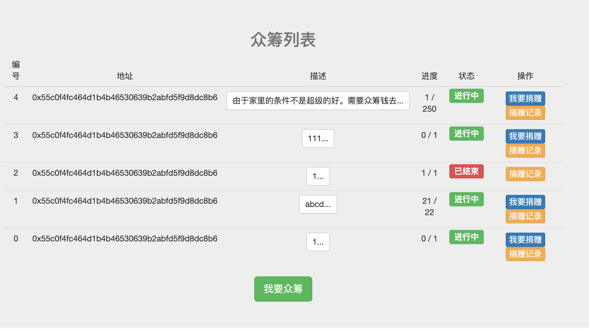
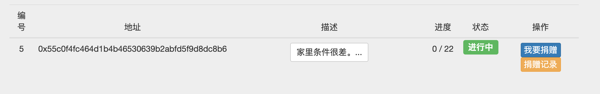
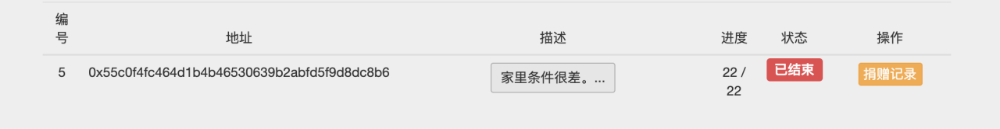
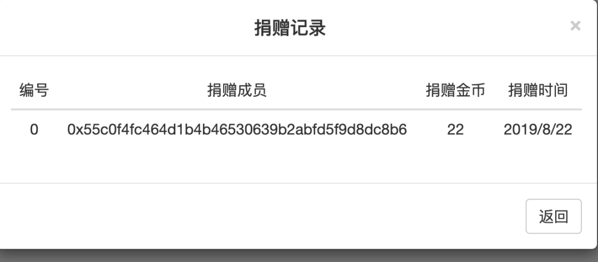

以太坊众筹系统（基于java）
众筹系统是基于以太坊solidity书写智能合约，并用基于web3j 开发web应用。 原项目地址：https://github.com/niyuelin1990/CrowdFunding
项目环境
1.IntelliJ IDEA 2016.3.2
2.Apache Tomcat 7.0.85
3.Geth 1.9.2-stable
4.操作系统macos 10.14.6

1、准备工作
 搭建 geth 私有环境：
我写的有一个geth的macos下的一键搭建，https://download.csdn.net/download/sinat_34774688/11593695。
Windows、linux下的CSDN也有，自己去找下。
不想用一键搭建的话，可以看这个博客https://www.jianshu.com/p/6c166db70388。

2、项目运行
把项目下的crowdfunding.sol的代码在remix（http://remix.ethereum.org/）先编写下改改错，因为当您看到这个项目的时候不知道solidity发行到了哪个版本了。
编译都通过了之后找到下图的位置，

点击3，在geth私有链下粘贴 
在geth下首先要对自己的帐户解锁，我用的是默认的用户，

注意在geth1.9的版本中解锁帐户会出现下面的问题
Error: account unlock with HTTP access is forbidden
异常原因
新版本geth，出于安全考虑，默认禁止了HTTP通道解锁账户，相关issue：https://github.com/ethereum/go-ethereum/pull/17037 
解决方案
如果已经了解打开此功能的风险，可通启动命令中添加参数：
--allow-insecure-unlock
来进行打开操作。
示例：
geth --rpc --rpcapi eth,web3,personal --allow-insecure-unlock
参考地址：http://www.choupangxia.com/2019/08/08/%e4%bb%a5%e5%a4%aa%e5%9d%8ageth%e6%96%b0%e7%89%88%e6%9c%acerror%ef%bc%9aaccount-unlock-with-http-access-is-forbidden/
帐户解锁后把图片3中的内容复制到geth中。然后回车，产生合约地址，

把产生的地址放到项目的config.properties中，如下图

导入 crowdfunding 工程
File -> new -> Module from Existing Sources... -> 选中pom.xml文件 -> 一直next
配置 config.properties 数据 同时开发挖矿
启动服务器 http://localhost:8080/crowdfunding
3、项目截图

