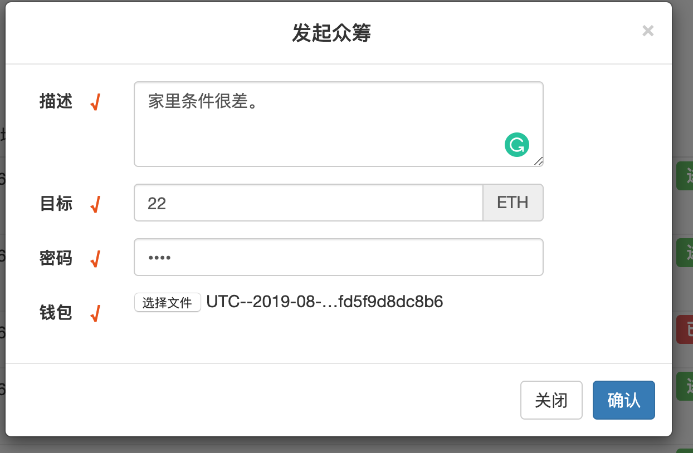

以太坊众筹系统（基于java）
众筹系统是基于以太坊solidity书写智能合约，并用基于web3j 开发web应用。 原项目地址：https://github.com/niyuelin1990/CrowdFunding
项目环境
1.IntelliJ IDEA 2016.3.2
2.Apache Tomcat 7.0.85
3.Geth 1.9.2-stable
4.操作系统macos 10.14.6

1、准备工作
 搭建 geth 私有环境：
我写的有一个geth的macos下的一键搭建，https://download.csdn.net/download/sinat_34774688/11593695。
Windows、linux下的CSDN也有，自己去找下。
不想用一键搭建的话，可以看这个博客https://www.jianshu.com/p/6c166db70388。

2、项目运行
把项目下的crowdfunding.sol的代码在remix（http://remix.ethereum.org/）先编写下改改错，因为当您看到这个项目的时候不知道solidity发行到了哪个版本了。
编译都通过了之后找到下图的位置，

点击3，在geth私有链下粘贴 
在geth下首先要对自己的帐户解锁，我用的是默认的用户，

注意在geth1.9的版本中解锁帐户会出现下面的问题
Error: account unlock with HTTP access is forbidden
异常原因
新版本geth，出于安全考虑，默认禁止了HTTP通道解锁账户，相关issue：https://github.com/ethereum/go-ethereum/pull/17037 
解决方案
如果已经了解打开此功能的风险，可通启动命令中添加参数：
--allow-insecure-unlock
来进行打开操作。
示例：
geth --rpc --rpcapi eth,web3,personal --allow-insecure-unlock
参考地址：http://www.choupangxia.com/2019/08/08/%e4%bb%a5%e5%a4%aa%e5%9d%8ageth%e6%96%b0%e7%89%88%e6%9c%acerror%ef%bc%9aaccount-unlock-with-http-access-is-forbidden/
帐户解锁后把图片3中的内容复制到geth中。然后回车，产生合约地址，

把产生的地址放到项目的config.properties中，如下图

导入 crowdfunding 工程
File -> new -> Module from Existing Sources... -> 选中pom.xml文件 -> 一直next
配置 config.properties 数据 同时开发挖矿
启动服务器 http://localhost:8080/crowdfunding
3、项目截图




编译都通过了之后找到下图的位置，


### 启动私有链
``` 
##初始化geth  genesis.json在工程目录
./geth init ./genesis.json --datadir "./chain"
##启动私有链，rpcaddr开启远程ip
./geth --datadir "./chain"  --rpc --rpcaddr 10.100.7.47 --rpcapi personal,db,eth,net,web3 --networkid 66

##新增账号
web3.personal.newAccount("123456")

##挖矿
miner.start(1)
miner.stop()

##转账
acc0 = web3.eth.accounts[0]
web3.personal.unlockAccount(acc0,"123456")
web3.eth.sendTransaction({from:acc0,to:acc1,value:web3.toWei(3,"ether")})
web3.eth.getBalance(acc)
```
其他api接口详见Web3-API接口说明文档.pdf(https://github.com/niyuelin1990/CrowdFunding/blob/master/Web3-API接口说明文档.pdf)


## 项目运行
1.生成合约代码
在https://ethereum.github.io/browser-solidity/ 目录地址下，Details获取crowdfunding.sol的代码
```
var crowdfundingContract = web3.eth.contract([{"constant":true,"inputs":[],"name":"getFundCount","outputs":[{"name":"","type":"uint256"}],"payable":false,"stateMutability":"view","type":"function"},{"constant":false,"inputs":[{"name":"info","type":"string"},{"name":"goal","type":"uint256"}],"name":"raiseFund","outputs":[],"payable":false,"stateMutability":"nonpayable","type":"function"},{"constant":true,"inputs":[{"name":"fundIndex","type":"uint256"}],"name":"getFundInfo","outputs":[{"name":"","type":"address"},{"name":"","type":"string"},{"name":"","type":"uint256"},{"name":"","type":"uint256"},{"name":"","type":"bool"}],"payable":false,"stateMutability":"view","type":"function"},{"constant":false,"inputs":[{"name":"fundIndex","type":"uint256"}],"name":"sendCoin","outputs":[],"payable":true,"stateMutability":"payable","type":"function"},{"constant":true,"inputs":[{"name":"fundIndex","type":"uint256"},{"name":"recordIndex","type":"uint256"}],"name":"getRecordInfo","outputs":[{"name":"","type":"address"},{"name":"","type":"uint256"},{"name":"","type":"uint256"}],"payable":false,"stateMutability":"view","type":"function"},{"constant":true,"inputs":[{"name":"fundIndex","type":"uint256"}],"name":"getRecordCount","outputs":[{"name":"","type":"uint256"}],"payable":false,"stateMutability":"view","type":"function"},{"payable":true,"stateMutability":"payable","type":"fallback"}]);
var crowdfunding = crowdfundingContract.new(
   {
     from: web3.eth.accounts[0], 
     data: '[contractcode]', 
     gas: '4700000'
   }, function (e, contract){
    console.log(e, contract);
    if (typeof contract.address !== 'undefined') {
         console.log('Contract mined! address: ' + contract.address + ' transactionHash: ' + contract.transactionHash);
    }
 })
 contractcode 为二进制代码
```


2.部署智能合约
```
1.web3.personal.unlockAccount(acc0,"123456")

2.部署上面的合约代码

3.部署成功会出现
 null [object Object]
Contract mined! address: 0x6777a18e0bc20506ac56ca7d1f870c54480b9dbb transactionHash: 0xcaf772219e7811bc057cebddedf3043e73892efed172ff74b71adc811648f0a3
```

3.导入 crowdfunding 工程
```
File -> new -> Module from Existing Sources... -> 选中pom.xml文件 -> 一直next
```
4.配置 config.properties 数据  同时开发挖矿

5.启动服务器 http://localhost:8080/crowdfunding


## 项目截图
1. 发起众筹

2. 发送ether

3. 众筹项目

其它注意：钱包要有钱(支付gas) 记得挖矿 等待确认 ......


## 项目目录
```
note:
src/main/resources/config.properties 配置文件
help:
--com.redhat.crowdfunding.util 工具包
----Consts.java 常量类
----Utils.java 工具类
--com.redhat.crowdfunding.model 模型类
----Fund.java 众筹项目
----Record.java 捐赠记录
--com.redhat.crowdfunding.contract 合约类
----CrowdFundingInterface.java HelloWorld 接口
----CrowdFundingContract.java HelloWorld 实现
----CrowdFundingMain.java HelloWorld 部署
--com.redhat.crowdfunding.service 服务类
----CrowdFundingService.java 接口
----CrowdFundingServiceImpl.java 实现
--com.redhat.crowdfunding.pool 对象池
----CrowdFundingServicePool.java
--com.redhat.crowdfunding.controller 控制器
----CrowdFundingController.java
```
## 参考
littleredhat1997/CrowdFunding
https://www.jianshu.com/p/7f9a01271ee7
